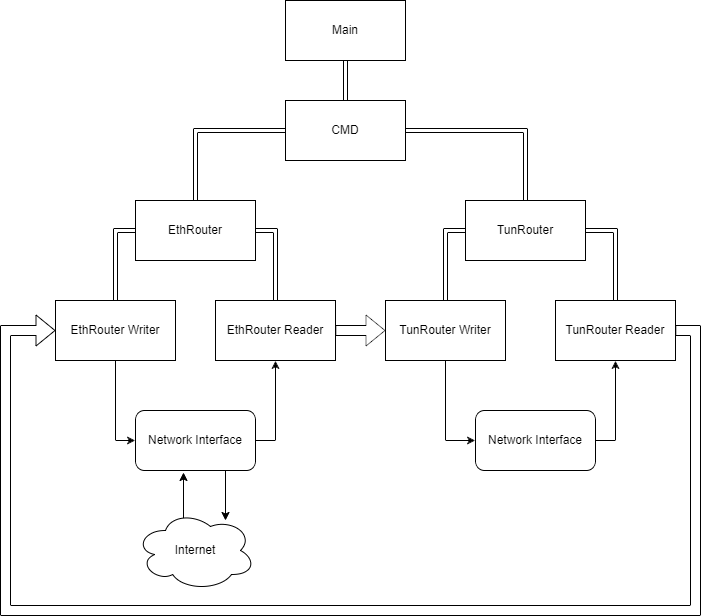
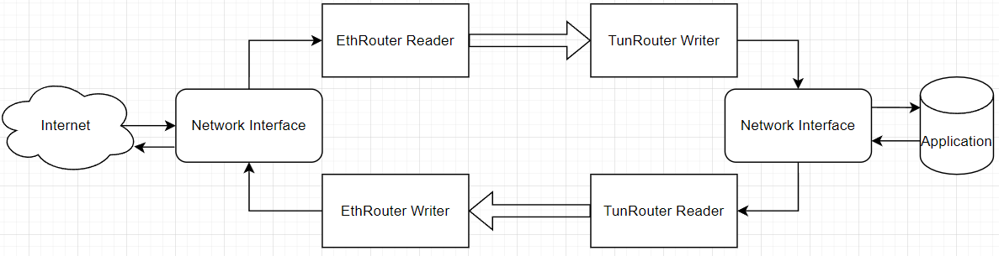

# Architecture

**This document describes the high-level architecture of this project**

If you want to familiarize yourself with the code base and _generally_ how it works, this is a good place to be.

## High Level TLDR

`main.go` loads `cmd/root.go` which runs the function `Root`. `Root`
starts all the magic. It does cli logic and program initialization of
state. `Root` also spawns the 2 major components, `ethrouter` and `tunrouter`. Think of `tunrouter` and `ethrouter` as the "supervisors" in the actor pattern. They don't do much super vising but they do some small management and error propegation.

Each `tunrouter` and `ethrouter` spawn their submodules. Submodules are either a `reader` or `writer`. Each are actions relating to resource stream management. Lets look at a diagram.

        

Ok that's a lot. Lets start where we left off. `main` spawns `Root`. `Root` spawns `tunrouter` and `ethrouter`. `tunrouter` spawns `tunrouter.reader` and `tunrouter writer`. `ethrouter` spawns `ethrouter.reader` and `ethrouter.writer`.

Each router is responsible for resource routing (one of literal network routing). Before we do that, lets look at a simplified diagram.

        

The big arrows are messages, in this case its channels.
Each thin line is either a read or a write.
`reader`s do more processing so the `writer`s can be quick writing as its a blocking operation.
This is achieved by an async patter.
`reader`s essentially read from a resource, spawn a channel with a copy of the read buffer, do processing of that data, then write to a channel.
`writer`s essentially read from channel and immediate write.
This completely ensures quick writes and async data processing.

In this case `ethrouter.reader` reads from a socket, then decrypts and decompresses the VPN packets, then writes to `tunrouter.writer`.
`tunrouter.writer` reads from channel and writes to the tun interface.

`tunrouter.reader` reads from the tun interface, compresses and encrypts the tun packets. After, it routes the traffic and writes to `ethrouter.writer`.
`ethrouter.writer` reads from channel and sends to routed host on socket.

## Code Map

#### Code Map Legend

`<file name>` for a file name

`<folder name>/` for a folder

`<folder name>/<file name>` for a file within a folder

### `main.go`

Main function where everything gets started.

### `cmd/`

Command line interface package where command line interface parsing stuff lives. We call this package `shanty` like sea shanty.

### `cmd/root.go`

Root command file which gets instantiated by `main.go`

### `config/`

Manages global config thats set at initialization time.

### `tun/`

Home of tun. This manages the tun interface. It brings it up, configures it, and kills it.

### `translate/`

Home of translation. This turns tun packets into VPN packets and vice versa. It both compresses and encrypts and decrypts and decompresses.

### `ethrouter/`

Home of ethrouter

### `ethrouter/ethrouter.go`

Basic supervisor of `ethrouter.writer` and `ethrouter.reader`

### `ethrouter/writer.go`

home of `ethrouter.writer`

### `ethrouter/reader.go`

home of `ethrouter.reader`

### `tunrouter/`

Home of tunrouter

### `tunrouter/tunrouter.go`

Basic supervisor of `tunrouter.writer` and `tunrouter.reader`

### `tunrouter/writer.go`

home of `tunrouter.writer`

### `tunrouter/reader.go`

home of `tunrouter.reader`
